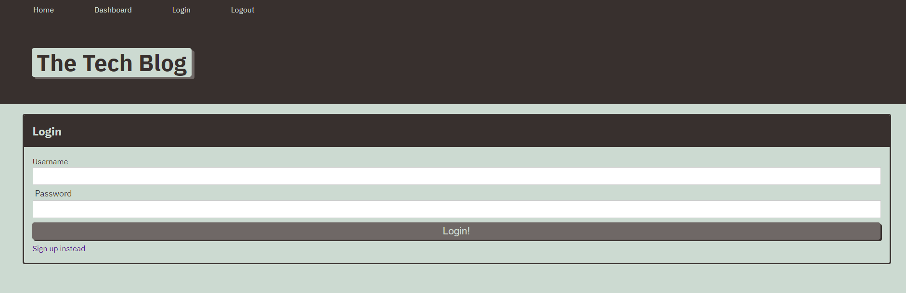
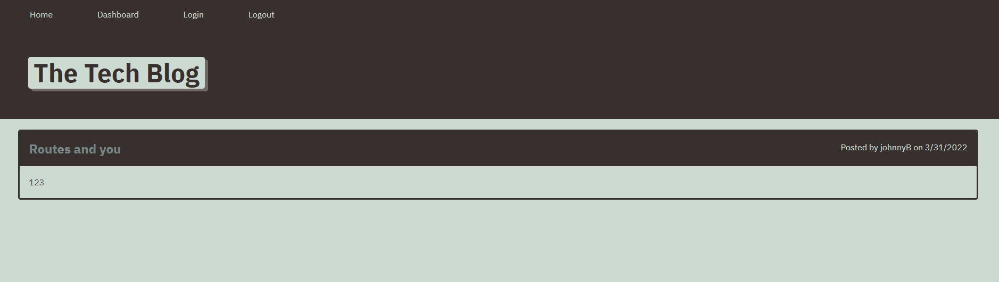
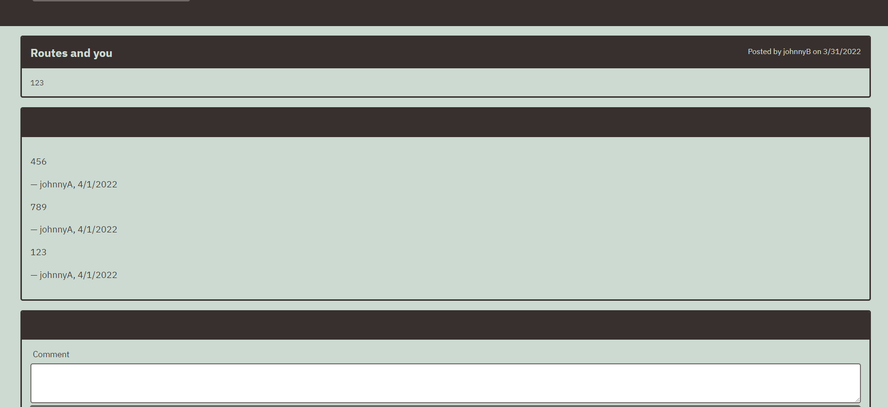

#   Tech Blog 

  ## Description
  I created a tech blog application.  You are able to create an account, the DB will save your user data. Fun and easy way to track your thoughts and share with your friends.
  
  ## Table of Contents
  
  - [Installation](#installation)
  - [Tools](#tools)
  - [License](#license)
  - [Screenshots](#screenshots)
  - [Questions](#questions)
  
  
  ## Installation
  
  Download the repo, npm i.
  
  
  ## Tools
  
  Sequelize, Express, Mysql2, Handlebars
  
  
  ## License

  
  
  ## Screenshots

[Live application](https://git.heroku.com/tech-blog.git)

  

  
  
  ## Questions

  If you have any questions about the project please contact me at.
  - [GitHub](https://github.com/Jsnyder159?tab=repositories)
  - Email: jw.snyder159@gmail.com
